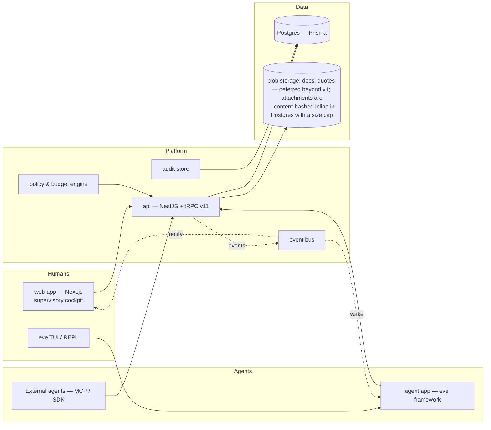
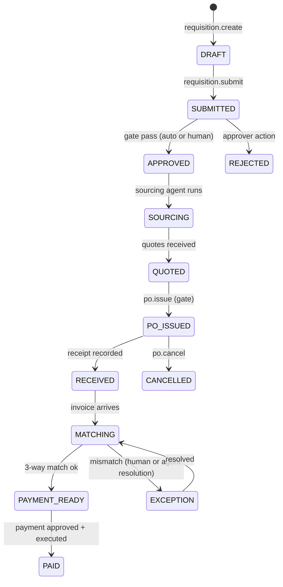

# aipms — Agentic-first Procurement Management System

**Status:** Draft v0.4 · **Owner:** platform/agent · **Repo:** `aipms` monorepo

---

## 1. Executive summary

`aipms` is a procurement management system (PMS) whose **primary users are AI
agents, not people**. Agents perform the day-to-day work of procurement —
sourcing, requisitioning, quoting, purchase-order handling, invoice matching,
expediting, and spend analysis — while humans supervise, approve, and handle
exceptions. The web application is a *supervisory cockpit* over an agent-run
operation, not a form-filling tool.

This inversion has consequences for every layer of the system:

| Classic PMS | aipms |
|---|---|
| Humans fill forms; software enforces workflow | Agents execute work; software gives agents tools, memory, and guardrails |
| UI is the primary client | The **agent API (tRPC) is the primary client**; the UI is a monitoring/approval surface |
| Approvals are process overhead | Approvals are deliberate human-in-the-loop (HITL) **gates** at risk points |
| Audit trail is a compliance afterthought | Every agent action is attributable, replayable, and stored immutably |
| Policy is config documents | Policy is a **machine-checkable guardrail** agents must obey |
| Concurrency is an edge case | Idempotency, retries, and sagas are core invariants (agents retry) |

The platform targets **private / enterprise procurement** first, deployed
**single-tenant and self-hostable** by each customer (see §16). Government /
agency procurement is an explicit **non-goal for v1** (§4.2): the engine
stays instance-configurable — policies, thresholds, and evaluation criteria
are data, not code — so a public deployment remains *possible* later without
a rewrite, but it is not built now. Key design decisions from planning
live in their owning sections and are marked ***(decided)***: invoicing
(§8.2), vendor messaging (§8.3), currency & tax (§8.4), ERP integration
(§8.5), payments (§8.6), agent topology (§7.5), and deployment (§16.2.1).

---

## 2. Problem & opportunity

Procurement is process-heavy, document-heavy, and exception-heavy — ideal for
agents and miserable for people:

- Requisitions route through policies, budgets, and approvers.
- Vendor research, quoting, and PO follow-up are repetitive, multi-step tasks.
- Three-way matching (PO ↔ receipt ↔ invoice) is mechanical but high-volume.
- Spend data is scattered; policy compliance is checked late, if ever.

An agentic-first PMS does not add a chatbot on top of a human CRM-style UI. It
**redesigns the system around agent capability**: agents hold a persistent
context, act through a typed tool surface, react to domain events, and are
constrained by budgets, policies, and approval gates. People stay in the loop at
the moments that matter and trust the system for everything else.

---

## 3. Vision & principles

### 3.1 Vision

> Procurement runs itself for everything routine; humans decide everything
> consequential. Every action — by agent or human — is visible, attributable,
> and reversible.

### 3.2 Principles

1. **Agents are first-class users.** They have identities, sessions, scopes,
   quotas, and auditability equivalent to humans.
2. **The API is the product.** The tRPC surface is designed and versioned as an
   agent tool interface. UI is one consumer among many.
3. **Agents propose; gates dispose.** No agent action that spends money,
   commits the company, or touches a counterparty executes without passing a
   machine-checkable gate (budget, policy, approval).
4. **Explicit permissions, not vibes.** Agent capabilities are scoped grants
   (`catalog.read`, `po.issue` …). Nothing is implicit.
5. **Everything is an event.** Domain events drive workflows, wake agents, and
   feed the audit trail. State is derived, not duplicated.
6. **Idempotency everywhere.** Every mutating tool call carries an idempotency
   key; retries are safe by construction.
7. **Human-in-the-loop at the right altitude.** Escalation thresholds, not
   approvals, are the default. Approval gates exist where risk exists.
8. **Fail visible.** Reasoning traces, actions, and outcomes are first-class
   observability artifacts, not debug afterthoughts.
9. **Compliance is code.** Regulations and policy are machine-checkable rules,
   evaluated in-transaction, in both sectors.
10. **Configuration over fork.** Sourcing style, thresholds, approval
   chains, and evaluation criteria are instance configuration (policy data),
   never hard-coded branches — no second codebase or divergent product.

---

## 4. Goals & non-goals

### 4.1 Goals (v1)

- Agent performs the full requisition-to-payment lifecycle for **routine and
  semi-routine** spend, with human approval gates.
- Typed, versioned agent API over tRPC with event subscriptions and idempotent
  mutations.
- Machine-enforced budgets and policy guardrails (spend limits, preferred
  vendors, approval chains, blacklists).
- Immutable, replayable audit trail of agent *and* human actions.
- Supervisory UI: exception queue, approval inbox, live spend, agent activity
  timeline.
- Agentic support: **one operator agent in Phase 1**, phasing into a thin
  orchestrator + ≤4 specialists (sourcing, ops, audit/match, compliance)
  sharing one domain model (topology per §7.5).
- Serve **private / enterprise** organizations first, deployed
  **single-tenant and self-hostable** by each customer (Docker / VM / PaaS) —
  the enterprise deployment story is the v1 product (§16).

### 4.2 Non-goals (v1)

- No autonomous payments without explicit approval (gate is mandatory).
- No natural-language UI as the primary interface (agents get typed tools).
- No general-purpose autonomous negotiation with third parties beyond
  **structured** quote requests and draft templates.
- No replacing the company ERP; aipms is the procurement layer that syncs out.
- No self-modifying policy: agents can *propose* policy changes; humans ratify.
- No government / public procurement in v1 — no PhilGEPS or e-procurement
  portal adapters, no sealed-bid gating, no public transparency plane, no
  NGPA (RA 12009) compliance bundles, no debarment or protest machinery.
  The engine keeps generic configurability (policies as data) so this remains
  possible later without a rewrite (§16.5).

---

## 5. Actors

| Actor | Identity | Examples |
|---|---|---|
| **Human requester** | Better Auth user (org member) | Employee requesting a laptop |
| **Human approver** | Better Auth user with role | Finance/manager approving > threshold |
| **Human admin / CPO** | Better Auth user with admin role | Sets policy, budgets, agent scopes |
| **Sourcing agent** | Service account (`user.kind = agent`) | Researches vendors, requests quotes |
| **Requisition agent** | Service account | Drafts requisitions, checks budget |
| **Ops agent** | Service account | Creates POs, expedites, matches invoices |
| **Auditor / LLM safety layer** | Service account | Replays runs, validates gate adherence |
| **Third-party systems** | API keys / webhooks | ERP, accounting, vendor portals |

Agents and humans share the same **user** table (`kind: human | agent`) — the
differentiator is scopes, quotas, and how sessions are created. The agent
*roles* above are the target specialist model (§7.5); **Phase 1 ships a single
operator agent** whose scopes cover these roles, splitting only when measured.

---

## 6. System architecture



### 6.1 Monorepo mapping (today → target)

| Package | Now | Target |
|---|---|---|
| `packages/db` | Prisma 7 + User/auth models | + procurement models (§9), migrations |
| `packages/auth` | Better Auth, email/password, Google | + org/RBAC, service-account tokens, agent sessions |
| `apps/api` | NestJS + tRPC scaffold, `users` router | + catalog/vendor/requisition/po/invoice routers |
| `apps/web` | Next.js 16 shell + tRPC provider | cockpit: exception queue, approvals, spend, agent timeline |
| `apps/agent` | eve `defineAgent` stub | multi-skill procurement agent wired to the API |
| `packages/env` | env loading | — (stable) |
| `packages/ui` | shadcn components | + tables, kanban, timeline components |

---

## 7. Agent model

### 7.1 Agent identity

- `user.kind = "agent"`, `agent.scopes = [...]`, `agent.quota = {...}`.
- Agents authenticate with **short-lived scoped bearer tokens** (Better Auth
  `bearer` plugin) minted for a run; never a shared password.
- Every agent run has a `run_id` and a parent `task_id`; all tool calls tag the
  run.

### 7.2 Capability model

Capabilities are the unit of permission:

```
catalog.read, catalog.write
vendor.read, vendor.request_quote
requisition.create, requisition.submit
budget.read, budget.commit
po.create, po.issue, po.cancel
invoice.read, invoice.match, invoice.ingest   // §8.2 intake
messaging.submit                              // §8.3 relay; tiered auto/gated
payment_run.compose                           // §8.6
approval.request, approval.revoke_request
spend.read
policy.read, policy.propose_change
audit.read
```

- Grants are **least-privilege per agent** and set by an admin.
- Dangerous capabilities (`po.issue` above a threshold, `invoice.match` with
  deviations) additionally require **gate attributes** (§10).

### 7.3 Agent runtime (eve)

`apps/agent` runs on the **eve framework** (AI SDK v7, `@vercel/connect`).
Agents expose their tool surface through `eve`'s channel model; the
procurement API is consumed as tools. Key integration points:

- **Tools = tRPC procedures**, wrapped with zod input contracts, idempotency
  keys, and scope checks.
- **Wake = event subscriptions**: agents register interest (e.g.
  `invoice.received` for matching; `requisition.approved` for PO creation).
- **Memory = per-org, per-context stores** (vendor research, negotiation state,
  recurring-spend patterns). *(Deferred beyond v1 — runs are stateless beyond
  domain reads; revisit when measured cost per workflow demands it.)*
- **Session = eve channel** with auth (Vercel OIDC / local dev) mapped to a
  `user.kind = agent` identity server-side.

### 7.4 Agent-level guardrails

- **Budget check before commit**: mutations that commit spend check
  budget + policy synchronously; violation ⇒ `FORBIDDEN` with a readable reason.
- **Escalation**: agents cannot approve their own work; any gate it hits routes
  to humans or to an independent agent with `approver-assistant` scope.
- **Rate & concurrency limits** per agent and per org (tRPC middleware).
- **Sandboxed side effects**: outbound email/portal writes go through the
  platform, templated, audited.

---

### 7.5 Agent topology (decided: thin orchestrator + few specialists)

The evidence is consistent across the field (Anthropic orchestrator-worker
case study; Princeton NLP benchmark; Microsoft / AWS guidance): a **single
agent with tightly-scoped tools** is the default and wins on cost, latency,
reliability, and debuggability — multi-agent wins only where task sets are
truly different and/or parallelizable. Procurement spans 10+ tool families,
which crosses the tool-selection ceiling (~10–15 tools) where one agent
starts degrading. So: **orchestrator + a small set of specialists**, while
resisting "an agent for every noun."

Topology by phase:
- **Phase 1 — one operator agent** behind the tRPC tool surface, with tools
  organized into skill bundles. Goal: prove **cost per successful workflow**
  before adding coordination machinery.
- **Phase 3+ — thin orchestrator + ≤4 specialists**, each a separate agent
  identity (own scopes, bearer token, SoD boundary):
  1. **Sourcing agent** — catalog, vendor research, RFQ/RFP/bids; big
     context, web tools, category intelligence loaded as skill bundles.
  2. **Ops agent** — requisition → PO → invoice → receipt; concrete CRUD +
     routing; can run on a cheaper, faster model.
  3. **Audit/match agent** — 3-way matching, duplicate & fraud detection,
     debarment checks; slow and careful, minimal context, deterministic
     helpers (OCR/parse) kept outside the LLM.
  4. *(optional)* **Compliance/release agent** — gate evaluation, debrief,
     publication drafts.

Why this split (from the evidence):
- Disjoint task sets + disjoint tool contexts is exactly where splitting
  pays; every inter-agent message is an LLM call, so headcount must be
  justified by measurement.
- **SoD by identity** — the sourcing agent can never issue/approve the same
  spend (§16.4); distinct principals make this structural.
- **Model economics** — tiered models per specialist (small/fast for ops,
  high-capability for research/review) is the multi-agent cost lever.
- **Parallelism & fault isolation** — one specialist failing does not stall
  the rest; per-agent tracing (`runId`) stays readable.

Guardrails:
- Keep specialists narrow; category intelligence is a **skill bundle**, not
  an agent (GEP). Add agents only when measured cost per workflow demands.
- Specialists output **structured JSON**; deterministic steps (OCR, parse,
  arithmetic match) run outside the LLM; tools are versioned; every run logs.
- The orchestrator decomposes, delegates, synthesizes, and **escalates to
  humans**; it never holds spend-granting tools itself.

---

## 8. Core domain — procurement lifecycle

### 8.1 Procure-to-pay lifecycle

The standard procure-to-pay workflow, with agents and gates annotated:



Domain objects (work-in-progress names; §9 defines storage):

- **CatalogItem** — purchasable goods/services, category, unit, default price.
- **Vendor** — identity, qualification status, contracts, ratings, blacklist.
- **Quote** — structured offer (item, price, lead time, validity) from a vendor,
  collected by agents. *(Implemented v0.6 as the `Quote` model + `sourcing`
  router: RFQ open → offer receive → deterministic compare (`lowestCost`
  default; `bestValue` via the evaluationCriterion policy's price weight) →
  exclusive award with outbox event.)*
- **Requisition** — a request for spend; lines reference catalog items or
  free-text; carries cost center, budget, urgency.
- **Approval** — a gate instance: policy route, assignee(s), decision, evidence.
- **PurchaseOrder** — commitment to a vendor; lines, terms, delivery schedule.
- **Receipt** — goods/services received against PO lines.
- **Invoice** — vendor bill; matched against PO + receipt (3-way).
- **PaymentRun** — batch of approved invoices; execution is a separate,
  approval-gated step.
- **Policy** — machine-checkable rules (§11).
- **Budget** — envelope per cost center/period with committed & spent amounts.
- **AuditEntry** — immutable event record (§12).

### 8.2 Invoice ingestion (decided: email + structured e-invoicing)

Ingestion is a **normalized intake queue** fed by channels — not a single
wire, and **not agent-crawling of third-party vendor portals** (fragile:
login/CAPTCHA, rate-limits, ToS, maintenance). Sequencing:

1. **Email (IMAP) — default, highest coverage.** Any supplier can email; zero
   onboarding. The agent reads the email body + attachments, classifies, and
   extracts arbitrary layouts without templates. *(Implemented v0.6: the api
   polls the org mailbox via `intake-imap.service`, dedupes on content hash,
   and resolves senders against the vendor master's verified channels.)* Email is the riskiest
   channel, so the intake pipe is **defensive**: SPF/DKIM/DMARC + sender
   domain matched to vendor master, bank-account-change validation,
   duplicate detection by content hash, anomalous-value flagging, and SoD
   gates on new vendor/bank data (§12).
2. **Structured e-invoicing (API / Peppol / EDI) — required for PH
   enterprise.** The BIR e-invoicing mandate (RR 11-2025) makes a
   machine-readable receiver an obligation for PH AP, not an option. Lower
   error and fraud; complements email for high-volume suppliers.
   *(Implemented v0.6: `structured-invoice.ts` parses BIR EIS JSON and
   Peppol/UBL 2.1 XML deterministically on receive — documents enter the
   queue pre-extracted via `intake.ingestStructured`; no LLM involved.)*
3. **In-product supplier upload portal — optional, later.** Self-service,
   low-fraud, but costs UI + onboarding; roadmap item only.

Self-host note: IMAP points at the org's own mailbox; structured e-invoicing
(Peppol) rides a certified Access Point or the org's own network — compatible
with an air-gapped instance whose LLM agent stays offline.

### 8.3 Vendor interaction & outbound messaging (decided: relay, not direct-send)

Agents **never send to vendors directly**. All outbound communication goes
through a **messaging relay (outbox)** with a tool boundary the agent cannot
bypass — a `messaging.submit(...)` surface whose policy sits *above* the tool,
never enforced by prompt. This is the industry approval-gateway / queue-hold
pattern; it guarantees audit, delivery control, and exemption handling.

- **Recipients are verified identities, not raw addresses.** An agent
  addresses a `VendorContact` (vendor-master record + verified address); the
  relay blocks sends to unknown, changed, or unverified contact addresses
  (fraud SoD, §12).
- **Sends ride the org's own domain** via a dedicated transactional email API
  or the org's SMTP relay (air-gapped / regulated enterprise), with SPF/DKIM/DMARC and a
  transactional stream kept separate from marketing.
- **Tiered content gates every send:**
  - low-risk / transactional (RFQ, PO status, delivery notice, invoice ack) →
    **auto-send**;
  - high-risk / binding (negotiation, award, commercial terms, legal / policy
    / third-party-PII) → **human approval queue**: a reviewer sees the draft
    (agent + rationale + thread), approves or edits, and only then is it
    released — and logged.
- **Templated by default**, with constrained fields and macros; free-form is
  reserved for the gated tier. Every message is an immutable `Message` row
  (agent, subject, recipient identity, template, body, status, timestamps,
  approval), so threads are replayable for procurement and audit.

**Supplier self-service portal:** deferred. It reduces email overhead for
high-volume suppliers (order / invoice / account status) but costs UI +
onboarding; the relay remains the primary channel (§8.2).

It fits single-tenant enterprise deployment: the relay uses the org's own
transport (or an in-network SMTP server with qualified signatures); agents
stay offline-capable, and nothing depends on a shared platform.

### 8.4 Currency & tax (decided: PHP base; PH tax in v1)

A PH-first, single-tenant instance should not default to USD. **The operating
currency is the Philippine Peso (PHP)**, and **tax handling is in v1** — PH
AP is tax-laden (VAT + withholding) and cannot be cleanly deferred.

- **Representation (multi-currency-safe data, single-currency v1).** Every
  money field stores `{ amount: minor-unit integer, currency: ISO-4217 }`,
  e.g. `{ currency: "PHP", minorUnits: 150000 }`. Multi-currency is
  **deferred** as a *feature* (FX parades, bank LCs), but the shape is ready
  for it — the schema never assumes a zero-currency float.
- **Currency default (PH enterprise).** PHP-first: foreign-denominated
  amounts keep the original amount + PHP equivalent + rate + valuation date,
  so procurement stays auditable without a live FX engine. Multi-currency is
  a deferred *feature*, not a schema change.
- **Tax engine (deterministic, not LLM).** PH rules as configurable policy:
  - **VAT 12%** (RA 9337; RA 12023 adds VAT on digital services): compute
    input VAT by taxable line, flag exempt lines; recoverable input VAT flows
    to the AP GL.
  - **EWT / creditable withholding:** the buying entity withholds at source —
    goods 1% / services 2% for Top Withholding Agents; professional ~5–15%
    by bracket; rental 5%; treaty rates for non-residents. Generate **BIR
    Form 2307** certificates and the monthly **1601-E** remittance summary
    per supplier.
  - Rates live in **configurable tax policies** (goods/service class,
    supplier type, withholding status), so other jurisdictions and norms
    layer in later.
  - **Net payment = gross including VAT position − withholding**; computed
    deterministically outside the LLM (the agent only routes and explains).
- **BIR e-invoice.** aipms is buyer-side (receives supplier invoices; it does
  not issue sales invoices), so the BIR e-invoicing mandate (RR 11-2025,
  extended to 31 Dec 2026 by RR 26-2025) is not an *issuance* obligation; but
  its **structured EIS XML/JSON format** must be parsed on the receive side
  (§8.2), alongside Peppol/EDI, so supplier e-invoices clear the intake queue.

### 8.5 ERP integration (decided: publish what you own, ingest what you use)

- **Which ERP?** No single anchor — the PH enterprise market spans
  QuickBooks / Xero / SAP / NetSuite / Dynamics. Build an
  **anti-corruption adapter layer** over a normalized posting manifest, and
  ship v1 with anchor adapters instead of pinning the product to one vendor:
  - **v1 anchor — governed journal export + one quick connector.** A
    validated **CSV/JSON journal-import file** that any ERP (SAP, NetSuite,
    Dynamics, Xero, QuickBooks) imports in v1, plus an OAuth connector for
    one PH-popular target (QuickBooks Online) as the concrete adapter.
    SAP/NetSuite native connectors are **later-phase adapters**, never v1
    blockers.
- **Who owns what** (the anti-pitfall rule): aipms is the author of record
  for *procurement transaction state* (RFQ → PO → invoice → approval); the
  ERP is the author of record for *master data* (vendor, GL account, budget)
  and final financial posting.
- **Direction is per-object, not one global way** — a naive one-way push
  leaves the lifecycle unsynced:
  - aipms **pushes (publishes)** its owned transactions — PO, AP
    invoice/voucher (VAT + withholding already computed, §8.4), payment-run
    instructions — as an **outbox, idempotent** feed the ERP consumes
    (§13: retries, saga, no dual-write). The ERP is the consumer.
  - aipms **pulls (ingests)** master data it does not own — vendor master,
    chart of accounts, budget registrations — on a schedule, reconciled.
  - ERP **returns status** (posted, paid, voided, adjusted, credited,
    rejected) → aipms reconciles the invoice/payment lifecycle.
- **Reconciliation is the reliability gate**: an amount-and-volume
  reconciliation between aipms and the ERP ledger closes clean, and
  divergence raises exceptions surfaced to finance — no silent drift (§13).

### 8.6 Payment execution (decided: hand-off runs in v1; bank-file later)

- **v1 = hand-off to finance, not bank-file execution.** aipms produces an
  **approved payment run** — the set of approved invoices, net amounts with
  VAT & withholding already computed (§8.4), verified vendor bank details,
  PESONet / payment instruction — but does **not** initiate a bank transfer. A
  finance officer executes the run in the org's own bank/Payment provider
  (PESONet batch is the correct rail: same-day, high-value, B2B / supplier
  payments; InstaPay is the low-value ≤50k real-time rail). aipms retains the run and reconciles status (paid /
  dishonored / rejected) back from the bank/ERP, keeping the invoice
  lifecycle closed.
- **Bank-file execution is a later phase, not v1.** It requires a banking /
  payment-provider / ISO-20022 connection, **maker–checker + out-of-band
  dual-approval** (no single agent or unit may move money), SoD hardening,
  and full reconciliation. Given PH digital-fraud exposure (digital-fraud
  rate ~13.4% in 2024, >2× global; surge in authorized-payment fraud),
  auto-execution is high-stakes and gated behind the fraud controls of §12.
- **Beneficiary bank-account control is essential even in v1.** Any change
  to a vendor's bank account must **re-verify + out-of-band confirm** before
  it can appear on a payment run — the classic supplier BEC / advance-fee
  modus. This rides on §8.2's defensive intake checks.
- **Deterministic by construction.** Run amount = Σ(gross ± VAT − withhold);
  computed outside the LLM; the agent composes the run and rationalizes
  exceptions only.

---

## 9. Data model (Prisma sketch)

Extends `packages/db/prisma/schema.prisma`. Highlights only — full fields
follow during implementation.

> **Money & tax**: the implementation stores money as `{ minorUnits, currency }`
> (per §8.4); `Decimal` below is the Prisma sketch form for readability. VAT /
> EWT fields appear on every money line; tax is computed deterministically by
> the tax engine (§8.4), never by the agent.
>
> **Instance configuration (§16.1)**: rules are **data** (`Policy` + `config`),
> never domain `switch`. `AwardCriterion`, `EntityClass`, and
> `PublicationState` are reserved up front so customer instances differ by
> config, not by schema migration.
>
> **Sketch scope**: enums (`ReqStatus`, `PoStatus`, `VendorStatus`, `RunStatus`,
> `InvoiceStatus`, …) and `*Line` models are elided here — they exist, with
> fields settled during implementation.

```prisma
enum UserKind { human agent }

tenum AwardCriterion {   // §16.1 — evaluation is config, not a fork
  lcrb mearb marb hrrb lowestCost bestValue
}

enum EntityClass {      // how a requirement is sourced
  catalog negotiated competitive
}

enum PublicationState { // publication is opt-in per instance (§16.1)
  sealed published redacted
}

model User {          // already present; add:
  kind      UserKind  @default(human)
  scopes    Json      @default("[]")   // agent capability grants
  quotas    Json?                      // rate/spend quotas for agents
}

model AgentRun {      // identity + audit of one agent execution
  id        String   @id
  agentId   String
  taskId    String?
  startedAt DateTime @default(now())
  finishedAt DateTime?
  status    RunStatus
  meta      Json?
}

model CatalogItem {
  id        String   @id
  sku       String   @unique
  name      String
  category  String
  unit      String
  active    Boolean  @default(true)
  defaultPrice Decimal?
  createdAt DateTime @default(now())
  updatedAt DateTime @updatedAt
}

model Vendor {
  id            String   @id
  name          String
  status        VendorStatus   // qualified | pending | blacklisted
  email         String?
  terms         Json?
  ratings       Decimal?
  createdAt     DateTime @default(now())
  updatedAt     DateTime @updatedAt
}

model Requisition {
  id          String   @id
  requestedBy String   // user id (human or agent)
  status      ReqStatus
  costCenter  String
  budgetId    String?
  priority    String   @default("normal")
  submittedAt DateTime?
  decidedAt   DateTime?
  lines       RequisitionLine[]
  approvals   Approval[]
  createdAt   DateTime @default(now())
  updatedAt   DateTime @updatedAt
}

model PurchaseOrder {
  id            String  @id
  requisitionId String?
  vendorId      String
  status        PoStatus
  currency      String  @default("PHP")
  total         Decimal
  terms         Json?
  issuedBy      String  // user id (usually an agent)
  issuedAt      DateTime?
  lines         PurchaseOrderLine[]
  receipts      Receipt[]
  invoices      Invoice[]
  createdAt     DateTime @default(now())
  updatedAt     DateTime @updatedAt
}

model Invoice {
  id        String     @id
  poId      String?
  vendorId  String
  number    String
  amount    Decimal          // gross before tax
  vatAmount     Decimal  @default(0)   // §8.4, tax engine
  ewtAmount     Decimal  @default(0)   // §8.4, withheld at source
  currency  String   @default("PHP")  // §8.4
  taxPolicyVersion String?   // policy version tax was computed against
  receivedAt DateTime  @default(now())
  status    InvoiceStatus   // received | matched | exception | paid
  match     MatchResult?    // 3-way match details
  createdAt DateTime @default(now())
  updatedAt DateTime @updatedAt
}

model IntakeDocument {   // §8.2: normalized ingestion queue
  id          String   @id
  channel     String   // EMAIL_IMAP | EINVOICE_PEPPOL | EINVOICE_EDI | API | PORTAL
  contentHash String   // dedupe across channels
  senderId    String?  // verified against Vendor master
  raw         Json?    // attachments, headers, original payload
  status      IntakeStatus // new | classifying | extracted | matched | exception | dropped
  classified  Json?    // agent: document type, vendor hint, amounts
  receivedAt  DateTime @default(now())
  @@unique([channel, contentHash])
}

model Message {          // §8.3: outbound relay (outbox), never direct-send
  id          String   @id
  vendorId    String
  vendorContactId String  // verified contact, not a free-form address
  agentId     String?
  templateId  String?
  subject     String
  bodyHash    String   // tamper-evidence
  tier        String   // auto | gated  (§8.3)
  status      String   // queued | approved | sent | rejected | failed
  approvedBy  String?
  sentAt      DateTime?
  threadId    String?
  createdAt   DateTime @default(now())
}

model PaymentRun {       // §8.6: approved run that finance executes
  id        String   @id
  runNumber String
  status    String   // composed | approved | dispatched | reconciled
  netTotal  Decimal
  currency  String   @default("PHP")
  invoices  Invoice[]
  approvedBy String
  createdAt DateTime @default(now())
}

model Budget {
  id          String   @id
  costCenter  String
  period      String   // e.g. "2026-01"
  limit       Decimal
  committed   Decimal  @default(0)   // POs
  spent       Decimal  @default(0)   // paid invoices
  updatedAt   DateTime @updatedAt
}

model Policy {
  id        String   @id
  name      String
  enabled   Boolean  @default(true)
  kind      PolicyKind   // threshold | preferredVendor | blacklist | approvalChain | ...
  config    Json     // machine-checkable rule payload
  updatedBy String
  updatedAt DateTime @updatedAt
}

model Approval {
  id            String   @id
  requisitionId String?
  kind          String   // threshold | policy | budgetOverride
  route         Json     // ordered assignees, chain
  status        ApprovalStatus
  decidedBy     String?
  decidedAt     DateTime?
  evidence      String?  // human note or agent rationale
  createdAt     DateTime @default(now())
  updatedAt     DateTime @updatedAt
}

model AuditEntry {
  id         String   @id
  runId      String?  // agent run, if an agent acted
  actorId    String   // user id (human or agent)
  actorKind  UserKind
  action     String   // e.g. "po.issue", "approval.decide"
  entity     String   // "PurchaseOrder"
  entityId   String?
  inputHash  String   // content-addressed payload
  before     Json?
  after      Json?
  at         DateTime @default(now())

  @@index([entity, entityId])
  @@index([actorId])
  @@index([runId])
}
```

Constraints & invariants:

- **Budget** `committed + spent <= limit` is enforced in a transaction with the
  committing mutation (PO issue, invoice acceptance), never via app-level
  read-check-then-write.
- **AuditEntry** is append-only: no update/delete procedures are exposed for it.
- **Policies are versioned** (add `version` + `supersedesId`); agent decisions
  cite the policy version they ran against.
- **Idempotency**: every mutating procedure takes `idempotencyKey`; keys resolve
  to a stored outcome (dedupe table), so agent retries are safe.

---

## 10. Human-in-the-loop design

### 10.1 Gates, not forms

Approvals exist only where risk exists:

| Risk | Default gate |
|---|---|
| Spend ≤ threshold & policy-ok | **Auto-approve** (agent proceeds) |
| Spend > threshold | Human approval (manager → finance by amount) |
| New/blacklisted vendor | Vendor qualification gate |
| Budget overrun | Budget override approval (never silent) |
| Invoice mismatch (> tolerance) | Exception queue (human or match agent) |
| PO cancellation after vendor confirmation | Human confirmation |

### 10.2 Exception queue

Every gate a machine cannot pass cleanly becomes a ticket in the web
**exception queue** with full context: what the agent tried, why it was blocked,
the policy citation, and suggested resolutions. Humans resolve by approving,
overriding (with reason), or instructing the agent.

### 10.3 Delegation & escalation

- Approvers delegate within chains (rotation, backup). *(Partially built:
  delegation UI is deferred; SLA breach detection shipped v0.6 — overdue
  pendings are stamped + broadcast via `approval.slaBreached`; automatic
  re-routing stays a human decision by design.)*
- SLAs per gate type; on timeout, escalate one level up (agent notifies via
  events → web notification).
- Agents can re-request approval with new evidence; they cannot bypass.

### 10.4 The "ticket/agent duality"

Every agent task has a human-readable ticket surface. A human can take over a
task mid-flight (pause agent, act, resume) — the agent's context and the audit
trail make handoff lossless.

---

## 11. Policy & compliance engine

Policies are **declarative, machine-checkable** rules, not prose:

```jsonc
{
  "kind": "threshold",
  "config": {
    "scope": "costCenter:eng",
    "autoApproveUpTo": 5000,
    "approvalChain": ["manager", "finance", "cfo"],  // by amount bands
    "budgetRequired": true
  }
}
```

Evaluation is a pure function `(policy, context) → decision` invoked inside the
same transaction as the guarded mutation. Outcomes recorded: `PASS`,
`NEED_APPROVAL`, `BLOCK` (each with citations). The same engine drives both
human workflows and agent tool calls — one source of truth.

---

## 12. Security & trust

- **AuthN**: Better Auth for humans; scoped bearer tokens for agents
  (short-lived, per-run, revocable).
- **AuthZ**: org + role (RBAC) for humans; **scope grants** for agents; tRPC
  middleware enforces both (`auth.middleware` already exists).
- **Least privilege**: agents never hold "admin"; capability grants are
  granular and audited on change.
- **Secrets**: vendor credentials, ERP tokens in `@workspace/env` +
  platform-managed secret store; never in agent prompts.
- **Content safety**: outbound templates; PII minimized in agent context;
  redaction of payment instrument data from reasoning traces.
- **Audit**: append-only `AuditEntry` with `inputHash` for tamper-evidence;
  `runId` links reasoning → tool call → outcome.
- **Rate & quota limits** per agent/org (tRPC global middleware) to bound blast
  radius.

---

## 13. Reliability & data integrity

- **Idempotency keys** on all mutating procedures (agents retry liberally).
- **Event bus with outbox**: domain mutations write to the outbox in the same
  transaction; a relay publishes events (wake agents, notify UI). No dual-write
  inconsistency.
- **Sagas** for multi-step ops (e.g., PO issue → budget commit → vendor notify):
  compensating actions defined per step, resumed on crash.
- **Retries with exponential backoff** for vendor-facing calls; each attempt
  carries the same `idempotencyKey`.
- **Dead-letter + replay** for events; state is derived, so replay converges.

---

## 14. Observability

- **Agent run traces**: `run_id` → tool calls → gate evaluations → events →
  outcome. UI timeline renders this for humans.
- **Metrics**: gate pass/block rates, approval SLA, exception volume, spend by
  category/cost center, agent success/failure by skill.
- **Audit queries**: "what did agent X do to PO-123?" and "who approved what and
  why?" are first-class views.
- **Reasoning disclosure**: model rationale is stored with each decision, marked
  *not* as evidence, available to auditors.

---

## 15. Web UI — supervisory cockpit

`apps/web` becomes:

- **Overview** — live spend vs budget, exception counts, agent health.
- **Exception queue** — blocked work with one-click approve/instruct.
- **Approvals inbox** — gates assigned to me, SLA timers.
- **Agent timeline** — per-run trace (replaces "activity log").
- **Catalog & vendors** — supervised master data (agents propose, humans bless).
- **Spend & audit views** — filters by cost center, agent, policy version.

UI is a consumer of the same tRPC API; no UI-only logic exists in the domain.

---

## 16. Enterprise deployment (single-tenant, self-hostable)

Enterprise procurement — especially regulated industries (banks, healthcare,
utilities, manufacturers) — imposes control, audit, and deployment constraints
that a shared multi-tenant SaaS cannot answer. aipms is therefore
**single-tenant and self-hostable**: every customer runs its own instance with
its own data, identity provider, and configuration. One deployment = one
organization; no tenant-isolation seams exist in the data model — isolation is
physical (your instance, your data).

### 16.1 One engine; configuration per instance

Instances differ by **configuration, never by code**:

- `procurementStyles` — which sourcing paths are enabled (catalog, RFQ,
  negotiated, framework order).
- `approvalChains` / `thresholds` / `evaluationCriteria` — policy data consumed
  by the §11 engine (`(policy, context) → decision`), never domain `switch`
  statements.
- `currency` + `taxPolicies` — the deterministic tax engine (§8.4) with
  per-instance rates and withholding rules.
- `transparency` — confidential by default; publication is opt-in.
- `deployment` — infra + model provider (cloud keys or a local/offline model
  endpoint).

Every change carries the check: **policy-driven over hard-coded branches** —
if a behavior differs per customer, it is a `Policy` + `config`, not a fork.

### 16.2 Single-tenant, self-hostable deployment

- **One deployment = one organization.** No tenant-isolation seams exist in
  the data model — isolation is physical (your instance, your data).
- **Configuration by environment, not code**: `@workspace/env` loads the
  repo-root `.env`; runtime-tunable settings live in a settings store.
- **One stack, packaged for the org**: web (Next.js) + api (NestJS + tRPC) +
  agent (eve) + Postgres, shipped as Docker Compose, VM images, or PaaS
  builds. The repo is the deployment unit.
- **Upgrades are migrations**: Prisma `migrate deploy` at boot; versioned
  releases; backup/restore of Postgres; no cross-tenant data migration ever.
- **Identity is the org's**: local accounts, or the org's IdP
  (OIDC/SAML/SCIM via `@better-auth/sso`). Departments/teams are RBAC groups
  inside the single org.
- **Observability is self-hosted**: structured stdout logging, health
  endpoints, optional OpenTelemetry export. Metrics stay in the instance.
- **Agent runtime is per-instance**: model provider is configured by the org
  (cloud keys) or run locally/offline (air-gapped / regulated deployments).
  No shared model service.

### 16.2.1 Distribution & upgrade story (decided: Docker Compose, single-node)

- **Primary distribution: Docker Compose, single node.** A multi-container
  stack — web (Next) + api (NestJS + tRPC) + agent (eve) + Postgres, plus an
  optional local LLM endpoint — on one host. This is the recognized sweet
  spot for single-tenant products: low overhead, auditable, no orchestration
  fleet, and no Kubernetes estate (and its ~2-FTE overhead) that a small org
  does not need.
- **Single-node default, three packages from one build:**
  - **Compose (default)**: `docker compose up -d` on a VM or bare metal —
    the enterprise on-prem target.
  - **Managed PaaS (egress-allowed)**: the same image on a managed host
    (Render / Railway / Fly.io / Cloud Run) for orgs that prefer a managed
    runtime — explicitly not the air-gapped choice (it implies outbound
    client egress).
  - **Air-gapped / offline bundle**: a signed offline artifact (images +
    model weights + dependency mirrors) staged in with zero egress; updates
    arrive via a reviewed, signed pipeline on a slow cadence. No phone-home
    at runtime.
- **Postgres ships in-stack** (mounted volume); managed Postgres is an
  override, not a requirement.
- **Instance configuration lives in env + a settings store** (currency PHP,
  tax policies, approval chains, model provider) — no code change between
  deployments.
- **Upgrades are boot-time migrations**: pinned image tags; `prisma migrate
  deploy` at boot; rollback = previous tag + `pg_dump` restore. Never a
  cross-tenant data journey.
- **HA is intentionally later.** Single-node is the audit-friendly default;
  failover/scale is a Phase-7+ extension chosen explicitly to avoid
  orchestration overhead for one-org deployments.
- **Offline LLM is an OpenAI-compatible endpoint** the agent points at — a
  locally served model (vLLM / TGI / Ollama) running open-weight families
  (Llama, Mistral, Qwen, DeepSeek) inside the boundary with zero egress, or
  BYO cloud keys when egress is permitted. **v1 ships BYO cloud keys** (the
  common first-deployment case); the endpoint abstraction is in place from
  day one so an in-boundary model is a later *config*, never a rewrite. Each
  instance may set a **provider gate** (residency, retention, no-retention)
  that must pass before the agent runtime goes live.

### 16.3 Security & trust (per deployment)

- Single-tenant removes cross-tenant attack surface; each instance is
  hardened to the org's requirements (SOC 2 / ISO evidence kits for
  enterprise).
- **Air-gapped / cleared environments**: the full stack deploys with a
  **local or cleared model runtime** — agents run **offline** (no egress to
  public LLM providers), POs carry qualified digital signatures, and the
  audit chain is tamper-evident.
- Agents (§7.3) must support an **offline model deployment**: the same
  skills/tools with hosted-model channels disabled.

### 16.4 Agent controls in the bound loop

- **SoD for agents**: an agent cannot both source/quote and issue/approve the
  same spend (mirrors human SoD).
- **Signing**: agents prepare documents but never countersign; POs carry
  qualified electronic signature gates (human + certificate).
- **Mandatory windows**: a notice/wait window must elapse before a follow-up
  executes; blocked otherwise.
- **Attribution**: agent actions are attributed like a named user's.

### 16.5 Out of scope (v1): government / public procurement

v1 is deliberately **enterprise-only**. No public-procurement machinery is
built in v1 — no PhilGEPS or e-procurement-portal adapters, no sealed-bid
processing, no public transparency/publishing plane, no debarment registries,
no NGPA (RA 12009) compliance bundles, no protest workflow. The engine
retains generic configurability (thresholds, evaluation criteria, and
compliance checks are policy data), so a public tier could be added without a
rewrite — but it is consciously deferred, not designed against. Research that
informed that potential tier is archived under `docs/research/`.

### 16.6 Roadmap delta (enterprise)

```
Phase 7 — Enterprise hardening (additive, no public machinery)
- single-tenant packaging: Docker Compose / VM / PaaS; migrate-deploy upgrades
- offline-model agent runtime (OpenAI-compatible endpoint) + provider gate
- identity: OIDC/SAML/SCIM via @better-auth/sso
- qualified signing for POs in air-gapped / regulated deployments
```

---

## 17. Phased roadmap

| Phase | Scope | Monorepo touchpoints |
|---|---|---|
| **0 — Foundation** (done) | db, env, auth, tRPC, agent stub | `packages/*`, `apps/api`, `apps/web`, `apps/agent` |
| **1 — Domain core** | Catalog, Vendor, Budget, Policy models + routers; audit trail; idempotency; **instance-config seams** (§9 enums, evaluation-ready Policy) | `packages/db`, `apps/api` |
| **2 — Requisition→PO** | Requisition, approval gates, PO issue, budget commit; exception queue | `apps/api`, `apps/web` |
| **3 — Agent skills** | Sourcing + requisition + ops agents on eve; events wake agents; scoped tokens | `apps/agent`, `packages/auth` |
| **4 — Invoicing & 3-way match** | Invoice ingestion (email + structured e-invoicing), matching, exceptions | `apps/api`, `apps/web` |
| **5 — Payments & ERP sync** | Payment runs (human-gated), outbound ERP/webhooks | `apps/api` |
| **6 — Hardening** | Replayable audit, replay/dead-letter, quotas, redaction, load | platform-wide |
| **7 — Enterprise hardening** | Single-tenant packaging polish, offline-model agent runtime, SSO (OIDC/SAML/SCIM), qualified signing (additive on shared core) | §16 |

---

## 18. Glossary

- **Gate** — a machine-checkable checkpoint (policy, budget, approval) that a
  mutation must pass.
- **HITL** — human-in-the-loop: humans at deliberate decision points.
- **Capability** — a scoped permission string granted to an agent.
- **Run** — one agent execution, identified and audited end-to-end.
- **3-way match** — reconcile PO, receipt, and invoice.
- **Outbox** — transactional event publication pattern.
- **Saga** — multi-step operation with compensating actions.
