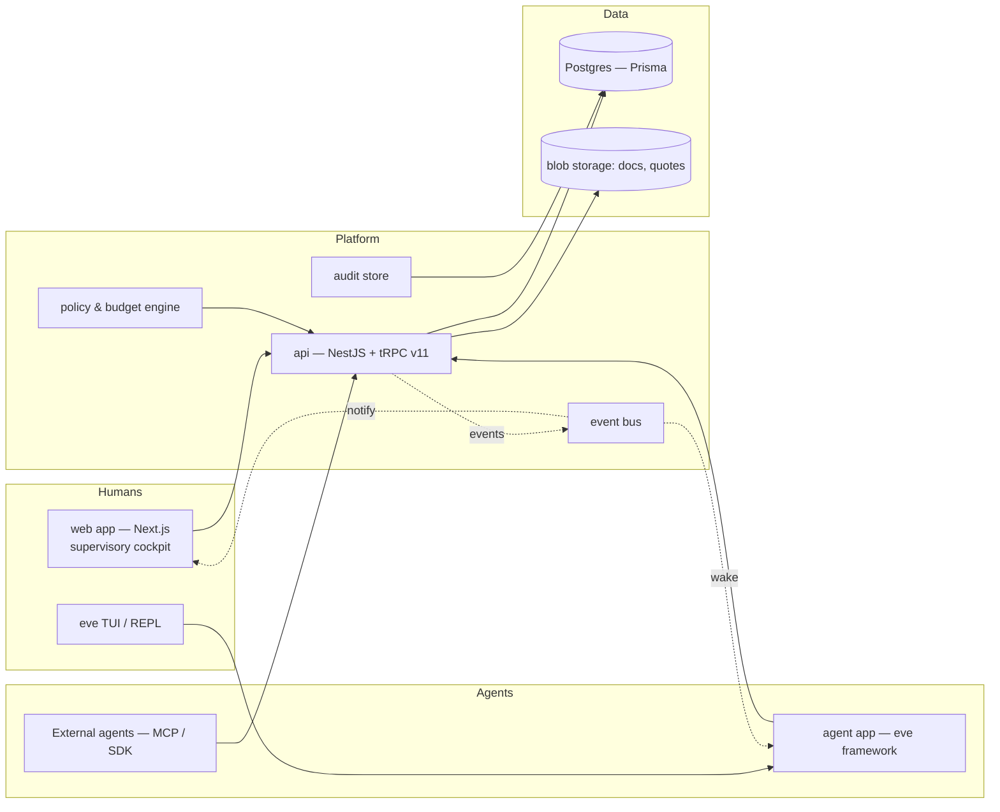
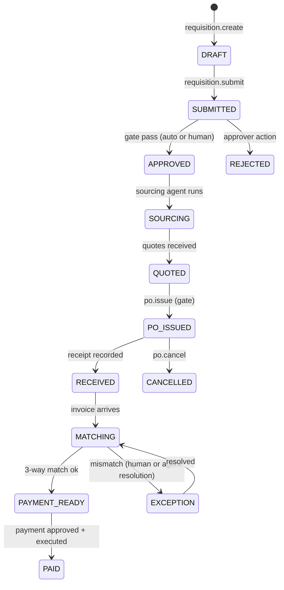

# aipms — Agentic-first Procurement Management System

**Status:** Draft v0.1 · **Owner:** platform/agent · **Repo:** `aipms` monorepo

---

## 1. Executive summary

`aipms` is a procurement management system (PMS) whose **primary users are AI
agents, not people**. Agents perform the day-to-day work of procurement —
sourcing, requisitioning, quoting, purchase-order handling, invoice matching,
expediting, and spend analysis — while humans supervise, approve, and handle
exceptions. The web application is a *supervisory cockpit* over an agent-run
operation, not a form-filling tool.

This inversion has consequences for every layer of the system:

| Classic PMS | aipms |
|---|---|
| Humans fill forms; software enforces workflow | Agents execute work; software gives agents tools, memory, and guardrails |
| UI is the primary client | The **agent API (tRPC) is the primary client**; the UI is a monitoring/approval surface |
| Approvals are process overhead | Approvals are deliberate human-in-the-loop (HITL) **gates** at risk points |
| Audit trail is a compliance afterthought | Every agent action is attributable, replayable, and stored immutably |
| Policy is config documents | Policy is a **machine-checkable guardrail** agents must obey |
| Concurrency is an edge case | Idempotency, retries, and sagas are core invariants (agents retry) |

---

## 2. Problem & opportunity

Procurement is process-heavy, document-heavy, and exception-heavy — ideal for
agents and miserable for people:

- Requisitions route through policies, budgets, and approvers.
- Vendor research, quoting, and PO follow-up are repetitive, multi-step tasks.
- Three-way matching (PO ↔ receipt ↔ invoice) is mechanical but high-volume.
- Spend data is scattered; policy compliance is checked late, if ever.

An agentic-first PMS does not add a chatbot on top of a human CRM-style UI. It
**redesigns the system around agent capability**: agents hold a persistent
context, act through a typed tool surface, react to domain events, and are
constrained by budgets, policies, and approval gates. People stay in the loop at
the moments that matter and trust the system for everything else.

---

## 3. Vision & principles

### 3.1 Vision

> Procurement runs itself for everything routine; humans decide everything
> consequential. Every action — by agent or human — is visible, attributable,
> and reversible.

### 3.2 Principles

1. **Agents are first-class users.** They have identities, sessions, scopes,
   quotas, and auditability equivalent to humans.
2. **The API is the product.** The tRPC surface is designed and versioned as an
   agent tool interface. UI is one consumer among many.
3. **Agents propose; gates dispose.** No agent action that spends money,
   commits the company, or touches a counterparty executes without passing a
   machine-checkable gate (budget, policy, approval).
4. **Explicit permissions, not vibes.** Agent capabilities are scoped grants
   (`catalog.read`, `po.issue` …). Nothing is implicit.
5. **Everything is an event.** Domain events drive workflows, wake agents, and
   feed the audit trail. State is derived, not duplicated.
6. **Idempotency everywhere.** Every mutating tool call carries an idempotency
   key; retries are safe by construction.
7. **Human-in-the-loop at the right altitude.** Escalation thresholds, not
   approvals, are the default. Approval gates exist where risk exists.
8. **Fail visible.** Reasoning traces, actions, and outcomes are first-class
   observability artifacts, not debug afterthoughts.

---

## 4. Goals & non-goals

### 4.1 Goals (v1)

- Agent performs the full requisition-to-payment lifecycle for **routine and
  semi-routine** spend, with human approval gates.
- Typed, versioned agent API over tRPC with event subscriptions and idempotent
  mutations.
- Machine-enforced budgets and policy guardrails (spend limits, preferred
  vendors, approval chains, blacklists).
- Immutable, replayable audit trail of agent *and* human actions.
- Supervisory UI: exception queue, approval inbox, live spend, agent activity
  timeline.
- Multi-agent support: distinct agents (sourcing, requester, approver-assistant,
  invoice-matching) sharing one domain model.

### 4.2 Non-goals (v1)

- No autonomous payments without explicit approval (gate is mandatory).
- No natural-language UI as the primary interface (agents get typed tools).
- No general-purpose autonomous negotiation with third parties beyond
  **structured** quote requests and draft templates.
- No replacing the company ERP; aipms is the procurement layer that syncs out.
- No self-modifying policy: agents can *propose* policy changes; humans ratify.

---

## 5. Actors

| Actor | Identity | Examples |
|---|---|---|
| **Human requester** | Better Auth user (org member) | Employee requesting a laptop |
| **Human approver** | Better Auth user with role | Finance/manager approving > threshold |
| **Human admin / CPO** | Better Auth user with admin role | Sets policy, budgets, agent scopes |
| **Sourcing agent** | Service account (`user.kind = agent`) | Researches vendors, requests quotes |
| **Requisition agent** | Service account | Drafts requisitions, checks budget |
| **Ops agent** | Service account | Creates POs, expedites, matches invoices |
| **Auditor / LLM safety layer** | Service account | Replays runs, validates gate adherence |
| **Third-party systems** | API keys / webhooks | ERP, accounting, vendor portals |

Agents and humans share the same **user** table (`kind: human | agent`) — the
differentiator is scopes, quotas, and how sessions are created.

---

## 6. System architecture



### 6.1 Monorepo mapping (today → target)

| Package | Now | Target |
|---|---|---|
| `packages/db` | Prisma 7 + User/auth models | + procurement models (§9), migrations |
| `packages/auth` | Better Auth, email/password, Google | + org/RBAC, service-account tokens, agent sessions |
| `apps/api` | NestJS + tRPC scaffold, `users` router | + catalog/vendor/requisition/po/invoice routers |
| `apps/web` | Next.js 16 shell + tRPC provider | cockpit: exception queue, approvals, spend, agent timeline |
| `apps/agent` | eve `defineAgent` stub | multi-skill procurement agent wired to the API |
| `packages/env` | env loading | — (stable) |
| `packages/ui` | shadcn components | + tables, kanban, timeline components |

---

## 7. Agent model

### 7.1 Agent identity

- `user.kind = "agent"`, `agent.scopes = [...]`, `agent.quota = {...}`.
- Agents authenticate with **short-lived scoped bearer tokens** (Better Auth
  `bearer` plugin) minted for a run; never a shared password.
- Every agent run has a `run_id` and a parent `task_id`; all tool calls tag the
  run.

### 7.2 Capability model

Capabilities are the unit of permission:

```
catalog.read, catalog.write
vendor.read, vendor.request_quote
requisition.create, requisition.submit
budget.read, budget.commit
po.create, po.issue, po.cancel
invoice.read, invoice.match
approval.request, approval.revoke_request
spend.read
policy.read, policy.propose_change
audit.read
```

- Grants are **least-privilege per agent** and set by an admin.
- Dangerous capabilities (`po.issue` above a threshold, `invoice.match` with
  deviations) additionally require **gate attributes** (§10).

### 7.3 Agent runtime (eve)

`apps/agent` runs on the **eve framework** (AI SDK v7, `@vercel/connect`).
Agents expose their tool surface through `eve`'s channel model; the
procurement API is consumed as tools. Key integration points:

- **Tools = tRPC procedures**, wrapped with zod input contracts, idempotency
  keys, and scope checks.
- **Wake = event subscriptions**: agents register interest (e.g.
  `invoice.received` for matching; `requisition.approved` for PO creation).
- **Memory = per-org, per-context stores** (vendor research, negotiation state,
  recurring-spend patterns).
- **Session = eve channel** with auth (Vercel OIDC / local dev) mapped to a
  `user.kind = agent` identity server-side.

### 7.4 Agent-level guardrails

- **Budget check before commit**: mutations that commit spend check
  budget + policy synchronously; violation ⇒ `FORBIDDEN` with a readable reason.
- **Escalation**: agents cannot approve their own work; any gate it hits routes
  to humans or to an independent agent with `approver-assistant` scope.
- **Rate & concurrency limits** per agent and per org (tRPC middleware).
- **Sandboxed side effects**: outbound email/portal writes go through the
  platform, templated, audited.

---

## 8. Core domain — procurement lifecycle



Domain objects (work-in-progress names; §9 defines storage):

- **CatalogItem** — purchasable goods/services, category, unit, default price.
- **Vendor** — identity, qualification status, contracts, ratings, blacklist.
- **Quote** — structured offer (item, price, lead time, validity) from a vendor,
  collected by agents.
- **Requisition** — a request for spend; lines reference catalog items or
  free-text; carries cost center, budget, urgency.
- **Approval** — a gate instance: policy route, assignee(s), decision, evidence.
- **PurchaseOrder** — commitment to a vendor; lines, terms, delivery schedule.
- **Receipt** — goods/services received against PO lines.
- **Invoice** — vendor bill; matched against PO + receipt (3-way).
- **PaymentRun** — batch of approved invoices; execution is a separate,
  approval-gated step.
- **Policy** — machine-checkable rules (§11).
- **Budget** — envelope per cost center/period with committed & spent amounts.
- **AuditEntry** — immutable event record (§12).

---

## 9. Data model (Prisma sketch)

Extends `packages/db/prisma/schema.prisma`. Highlights only — full fields
follow during implementation.

```prisma
enum UserKind { human agent }

model User {          // already present; add:
  kind      UserKind  @default(human)
  scopes    Json      @default("[]")   // agent capability grants
  quotas    Json?                      // rate/spend quotas for agents
}

model AgentRun {      // identity + audit of one agent execution
  id        String   @id
  agentId   String
  taskId    String?
  startedAt DateTime @default(now())
  finishedAt DateTime?
  status    RunStatus
  meta      Json?
}

model CatalogItem {
  id        String   @id
  sku       String   @unique
  name      String
  category  String
  unit      String
  active    Boolean  @default(true)
  defaultPrice Decimal?
  createdAt DateTime @default(now())
  updatedAt DateTime @updatedAt
}

model Vendor {
  id            String   @id
  name          String
  status        VendorStatus   // qualified | pending | blacklisted
  email         String?
  terms         Json?
  ratings       Decimal?
  createdAt     DateTime @default(now())
  updatedAt     DateTime @updatedAt
}

model Requisition {
  id          String   @id
  requestedBy String   // user id (human or agent)
  status      ReqStatus
  costCenter  String
  budgetId    String?
  priority    String   @default("normal")
  submittedAt DateTime?
  decidedAt   DateTime?
  lines       RequisitionLine[]
  approvals   Approval[]
  createdAt   DateTime @default(now())
  updatedAt   DateTime @updatedAt
}

model PurchaseOrder {
  id            String  @id
  requisitionId String?
  vendorId      String
  status        PoStatus
  currency      String  @default("USD")
  total         Decimal
  terms         Json?
  issuedBy      String  // user id (usually an agent)
  issuedAt      DateTime?
  lines         PurchaseOrderLine[]
  receipts      Receipt[]
  invoices      Invoice[]
  createdAt     DateTime @default(now())
  updatedAt     DateTime @updatedAt
}

model Invoice {
  id        String     @id
  poId      String?
  vendorId  String
  number    String
  amount    Decimal
  receivedAt DateTime  @default(now())
  status    InvoiceStatus   // received | matched | exception | paid
  match     MatchResult?    // 3-way match details
  createdAt DateTime @default(now())
  updatedAt DateTime @updatedAt
}

model Budget {
  id          String   @id
  costCenter  String
  period      String   // e.g. "2026-01"
  limit       Decimal
  committed   Decimal  @default(0)   // POs
  spent       Decimal  @default(0)   // paid invoices
  updatedAt   DateTime @updatedAt
}

model Policy {
  id        String   @id
  name      String
  enabled   Boolean  @default(true)
  kind      PolicyKind   // threshold | preferredVendor | blacklist | approvalChain | ...
  config    Json     // machine-checkable rule payload
  updatedBy String
  updatedAt DateTime @updatedAt
}

model Approval {
  id            String   @id
  requisitionId String?
  kind          String   // threshold | policy | budgetOverride
  route         Json     // ordered assignees, chain
  status        ApprovalStatus
  decidedBy     String?
  decidedAt     DateTime?
  evidence      String?  // human note or agent rationale
  createdAt     DateTime @default(now())
  updatedAt     DateTime @updatedAt
}

model AuditEntry {
  id         String   @id
  runId      String?  // agent run, if an agent acted
  actorId    String   // user id (human or agent)
  actorKind  UserKind
  action     String   // e.g. "po.issue", "approval.decide"
  entity     String   // "PurchaseOrder"
  entityId   String?
  inputHash  String   // content-addressed payload
  before     Json?
  after      Json?
  at         DateTime @default(now())

  @@index([entity, entityId])
  @@index([actorId])
  @@index([runId])
}
```

Constraints & invariants:

- **Budget** `committed + spent <= limit` is enforced in a transaction with the
  committing mutation (PO issue, invoice acceptance), never via app-level
  read-check-then-write.
- **AuditEntry** is append-only: no update/delete procedures are exposed for it.
- **Policies are versioned** (add `version` + `supersedesId`); agent decisions
  cite the policy version they ran against.
- **Idempotency**: every mutating procedure takes `idempotencyKey`; keys resolve
  to a stored outcome (dedupe table), so agent retries are safe.

---

## 10. Human-in-the-loop design

### 10.1 Gates, not forms

Approvals exist only where risk exists:

| Risk | Default gate |
|---|---|
| Spend ≤ threshold & policy-ok | **Auto-approve** (agent proceeds) |
| Spend > threshold | Human approval (manager → finance by amount) |
| New/blacklisted vendor | Vendor qualification gate |
| Budget overrun | Budget override approval (never silent) |
| Invoice mismatch (> tolerance) | Exception queue (human or match agent) |
| PO cancellation after vendor confirmation | Human confirmation |

### 10.2 Exception queue

Every gate a machine cannot pass cleanly becomes a ticket in the web
**exception queue** with full context: what the agent tried, why it was blocked,
the policy citation, and suggested resolutions. Humans resolve by approving,
overriding (with reason), or instructing the agent.

### 10.3 Delegation & escalation

- Approvers delegate within chains (rotation, backup).
- SLAs per gate type; on timeout, escalate one level up (agent notifies via
  events → web notification).
- Agents can re-request approval with new evidence; they cannot bypass.

### 10.4 The "ticket/agent duality"

Every agent task has a human-readable ticket surface. A human can take over a
task mid-flight (pause agent, act, resume) — the agent's context and the audit
trail make handoff lossless.

---

## 11. Policy & compliance engine

Policies are **declarative, machine-checkable** rules, not prose:

```jsonc
{
  "kind": "threshold",
  "config": {
    "scope": "costCenter:eng",
    "autoApproveUpTo": 5000,
    "approvalChain": ["manager", "finance", "cfo"],  // by amount bands
    "budgetRequired": true
  }
}
```

Evaluation is a pure function `(policy, context) → decision` invoked inside the
same transaction as the guarded mutation. Outcomes recorded: `PASS`,
`NEED_APPROVAL`, `BLOCK` (each with citations). The same engine drives both
human workflows and agent tool calls — one source of truth.

---

## 12. Security & trust

- **AuthN**: Better Auth for humans; scoped bearer tokens for agents
  (short-lived, per-run, revocable).
- **AuthZ**: org + role (RBAC) for humans; **scope grants** for agents; tRPC
  middleware enforces both (`auth.middleware` already exists).
- **Least privilege**: agents never hold "admin"; capability grants are
  granular and audited on change.
- **Secrets**: vendor credentials, ERP tokens in `@workspace/env` +
  platform-managed secret store; never in agent prompts.
- **Content safety**: outbound templates; PII minimized in agent context;
  redaction of payment instrument data from reasoning traces.
- **Audit**: append-only `AuditEntry` with `inputHash` for tamper-evidence;
  `runId` links reasoning → tool call → outcome.
- **Rate & quota limits** per agent/org (tRPC global middleware) to bound blast
  radius.

---

## 13. Reliability & data integrity

- **Idempotency keys** on all mutating procedures (agents retry liberally).
- **Event bus with outbox**: domain mutations write to the outbox in the same
  transaction; a relay publishes events (wake agents, notify UI). No dual-write
  inconsistency.
- **Sagas** for multi-step ops (e.g., PO issue → budget commit → vendor notify):
  compensating actions defined per step, resumed on crash.
- **Retries with exponential backoff** for vendor-facing calls; each attempt
  carries the same `idempotencyKey`.
- **Dead-letter + replay** for events; state is derived, so replay converges.

---

## 14. Observability

- **Agent run traces**: `run_id` → tool calls → gate evaluations → events →
  outcome. UI timeline renders this for humans.
- **Metrics**: gate pass/block rates, approval SLA, exception volume, spend by
  category/cost center, agent success/failure by skill.
- **Audit queries**: "what did agent X do to PO-123?" and "who approved what and
  why?" are first-class views.
- **Reasoning disclosure**: model rationale is stored with each decision, marked
  *not* as evidence, available to auditors.

---

## 15. Web UI — supervisory cockpit

`apps/web` becomes:

- **Overview** — live spend vs budget, exception counts, agent health.
- **Exception queue** — blocked work with one-click approve/instruct.
- **Approvals inbox** — gates assigned to me, SLA timers.
- **Agent timeline** — per-run trace (replaces "activity log").
- **Catalog & vendors** — supervised master data (agents propose, humans bless).
- **Spend & audit views** — filters by cost center, agent, policy version.

UI is a consumer of the same tRPC API; no UI-only logic exists in the domain.

---

## 16. Phased roadmap

| Phase | Scope | Monorepo touchpoints |
|---|---|---|
| **0 — Foundation** (done) | db, env, auth, tRPC, agent stub | `packages/*`, `apps/api`, `apps/web`, `apps/agent` |
| **1 — Domain core** | Catalog, Vendor, Budget, Policy models + routers; audit trail; idempotency | `packages/db`, `apps/api` |
| **2 — Requisition→PO** | Requisition, approval gates, PO issue, budget commit; exception queue | `apps/api`, `apps/web` |
| **3 — Agent skills** | Sourcing + requisition + ops agents on eve; events wake agents; scoped tokens | `apps/agent`, `packages/auth` |
| **4 — Invoicing & 3-way match** | Invoice ingestion (email/portal), matching, exceptions | `apps/api`, `apps/web` |
| **5 — Payments & ERP sync** | Payment runs (human-gated), outbound ERP/webhooks | `apps/api` |
| **6 — Hardening** | Replayable audit, replay/dead-letter, quotas, redaction, load | platform-wide |

---

## 17. Open questions (to resolve in Phase 1)

1. **Invoice ingestion** — email inbox (IMAP), vendor portals (crawled by
   agents), or API/webhook-first? (Assumption: email + API first.)
2. **Agent topology** — one generalist agent with skills vs. several
   specialist agents (sourcing, ops, matching)? (Assumption: several
   specialists sharing the domain; one orchestrator.)
3. **Vendor interaction** — do agents email vendors directly (templated,
   audited) or via a relay/portal? (Assumption: relay, v1 templated email.)
4. **Currency & tax** — multi-currency, tax handling in v1?
   (Assumption: single currency, USD; multi-currency deferred.)
5. **ERP sync target** — which ERP, and does it push or pull?
6. **Payment execution** — does aipms execute payments (bank file) or hand
   approved invoices to accounting? (Assumption: hand off, v1.)

---

## 18. Glossary

- **Gate** — a machine-checkable checkpoint (policy, budget, approval) that a
  mutation must pass.
- **HITL** — human-in-the-loop: humans at deliberate decision points.
- **Capability** — a scoped permission string granted to an agent.
- **Run** — one agent execution, identified and audited end-to-end.
- **3-way match** — reconcile PO, receipt, and invoice.
- **Outbox** — transactional event publication pattern.
- **Saga** — multi-step operation with compensating actions.
